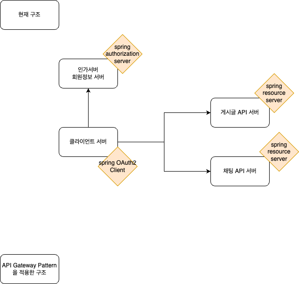

# modu_practice

현재 설계 구조  
------------
  

1. 클라이언트 서버가 인가서버와 통신하며 로그인 성공하여 인가서버로부터 JWT 토큰을 가지고 옴.
2. 이 토큰을 가지고 API 자원 서버에 자원을 요청함.
3. API 서버는 클라이언트 서버가 제시한 토큰이 올바른지 확인하기 위하여 인가서버에 /oauth2/jwks 요청을 함으로써 jwk (Json Web Key) 를 받아오고, 이것을 토대로 JWT를 검증함.
4. 토큰이 검증에 성공할 경우 API 서버에서 시큐리티를 통과하고 MVC 로 가서 자원을 response 해줌.

- 마이크로서비스(API 자원 서버)가 많아지면 토큰 검증 기능을 모든 마이크로서비스에 일일이 붙이는 것은 바람직하지 않은 설계일 것이다.
- 토큰 검증 기능을 gateway 서버 한 곳에서 처리하도록 하는 것이 더 나은 설계일 듯.
- gateway 서버는 spring cloud gateway 같은 api gateway framework 를 사용하지 않고, 그냥 스프링 서버를 하나 두어서 모든 마이크로서비스들에 대한 게이트웨이 역할을 하도록 시큐리티와 mvc 코드로 개발...?
- Istio 는 인증,인가,라우팅 이외의 다른 서비스 메시 기능들 (로드밸런싱, 로깅, 모니터링 등등)을 위해 붙일 수 있지 않을까.
- 