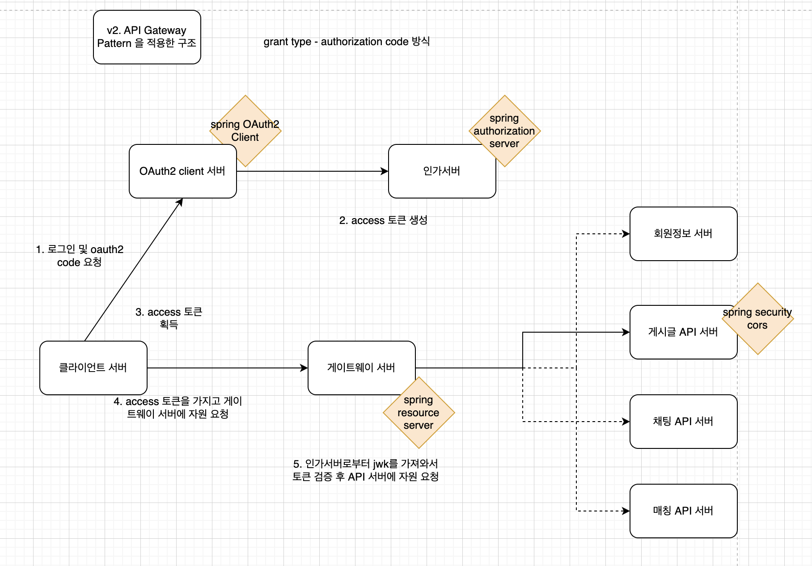

# modu_practice

branch: develop_gatewaypattern

현재 설계 구조 v2  
------------
  

1. 화면서버 - OAuth2 Client 서버 - 인가서버 통신으로 로그인 및 OAuth 인증 진행.
2. 인가서버 access token 발행
3. OAuth2 Client 서버가 먼저 access token을 받은 다음에 화면서버로 access token 을 쿠키에 담아서 넘겨줌.
3. 쿠키에 있는 access 토큰을 가지고 게이트웨이 서버에 자원 요청
4. 게이트웨이 서버는 토큰 검증 후에 적절한 토큰인 경우 API 서버에 자원 요청
5. 자원 서버는 자원을 응답함.
6. 게이트웨이 서버는 정보를 가공해서 화면 서버에 응답함.
   1. 여러 마이크로서비스에서 자원을 얻어서 가공하여 한 번에 내주는 역할을 게이트웨이 서버에서 하지 않고 Query 서버를 따로 둬서 맡기는 것이 좋을까
   2. 그렇다면 Command 역할(POST 요청)을 게이트웨이 서버가 맡는 것이 좋을까 Command 만을 위한 서버를 따로 두는 것이 좋을까

---
고민 v2
- 남의 것을 CRUD 하지 못하도록 막아야 할 경우에는 어느 지점에서 처리하는 로직을 만들면 좋을까

앞으로 할 것
- 화면서버와 API 서버 사이에 게이트웨이 서버를 두어서 gateway pattern 을 만든다.
- API 서버는 게이트웨이 서버의 요청만 받아들이도록 할 것
  - API 서버에 cors 설정을 해서 게이트웨이 서버만 allow origin 하도록 하면 될텐데, 로컬 환경에서는 모든 도메인이 localhost이다보니 API 서버 자원을 막을 방법이 없는 듯 하다... 
  - 토큰검증은 게이트웨이서버에서 이미 하고 끝나버렸으니 현재 API 서버는 무방비상태

고민 v1
- 로그인할 때 인가서버에서 회원 조회를 한 다음 access_token 을 내주는 구조로 만든다면 회원정보 서버에 한정해서 인가서버의 요청을 받을 수 있도록 해야 할까...? 

고민 v0
- 마이크로서비스(API 자원 서버)가 많아지면 토큰 검증 기능을 모든 마이크로서비스에 일일이 붙이는 것은 바람직하지 않은 설계일 것이다.
- 토큰 검증 기능을 gateway 서버 한 곳에서 처리하도록 하는 것이 더 나은 설계일 듯.
- gateway 서버는 spring cloud gateway 같은 api gateway framework 를 사용하지 않고, 그냥 스프링 서버를 하나 두어서 모든 마이크로서비스들에 대한 게이트웨이 역할을 하도록 시큐리티와 mvc 코드로 개발...?
- Istio 는 인증,인가,라우팅 이외의 다른 서비스 메시 기능들 (로드밸런싱, 로깅, 모니터링 등등)을 위해 붙일 수 있지 않을까.